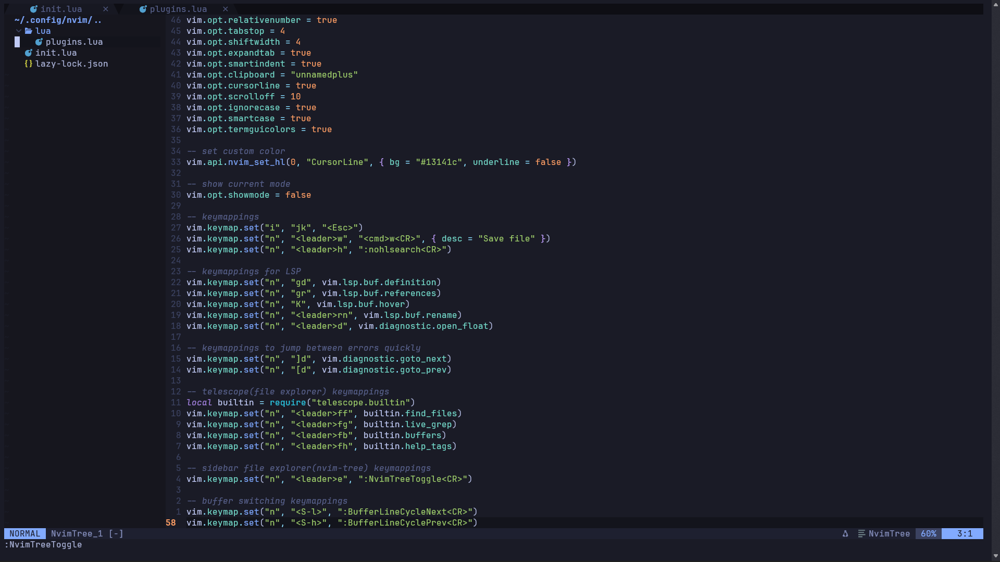

# 😇 **My Neovim Configuration** 😇

# 🔌 **Plugins** 👈

* *tokyonight.nvim*
* *nvim-treesitter*
* *clangd LSP*
* *telescope.nvim*
* *nvim-tree.lua*
* *bufferline.nvim*
* *lualine.nvim*

# **😎 UI Style 💁‍♂️**

# 🔧 **Requirements** 🔨

* *Neovim >= 0.9*
* *ripgrep*
* *clangd*
* *Nerd Font*

# 📦 **Installation** 🚀

**Clone the repository**

git clone https://github.com/PanicMike-9/neovim-config.git ~/.config/nvim
