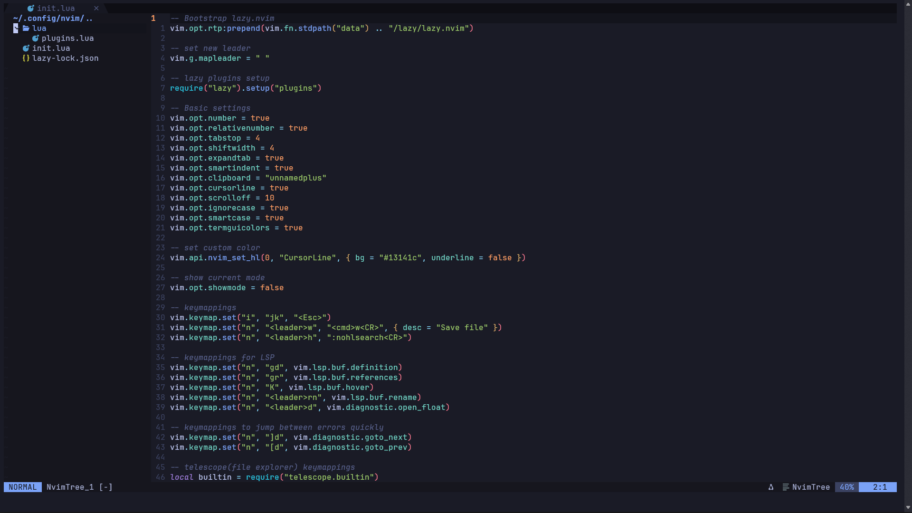

# 😇 My Neovim Configuration 😇
## Minimal Neovim setup for easy navigation and clean look

## 🔌 Plugins 👈

* *tokyonight.nvim*
* *nvim-treesitter*
* *clangd LSP*
* *telescope.nvim*
* *nvim-tree.lua*
* *bufferline.nvim*
* *lualine.nvim*
* *rainbow-delimiters*

## 😎 UI Style 💁‍♂️



## 🔧 Requirements 🔨

* *Neovim >= 0.9*
* *ripgrep*
* *clangd*
* *Nerd Font*

## 📦 Installation 🚀

**Clone the repository**
 ``` bash
git clone https://github.com/PanicMike-9/neovim-config.git ~/.config/nvim
```
